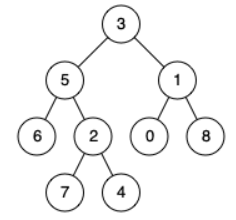

# Problem Statement

[LeetCode - Lowest Common Ancestor of a Binary Tree](https://leetcode.com/problems/lowest-common-ancestor-of-a-binary-tree/description/?envType=study-plan-v2&envId=leetcode-75)

Given a binary tree, find the lowest common ancestor (LCA) of two given nodes in the tree.

According to the definition of LCA on Wikipedia: “The lowest common ancestor is defined between two nodes p and q as the lowest node in T that has both p and q as descendants (where we allow a node to be a descendant of itself).”

## Examples

### Example 1


**Input**: root = [3,5,1,6,2,0,8,null,null,7,4], p = 5, q = 1
**Output**: 3
**Explanation**: The LCA of nodes 5 and 1 is 3.

## Observations

We need to track the parent. The way we can track values or "remember" them is through a stack. Thus DFS is the most effective choice. Now to understand LCA, there are two key points:

1. If our root or a node in subtree matches either p or q, it is **potentially** an LCA
2. If the left and right both exist for a node, then according to the definition, it is **definitely** an LCA.
3. Otherwise either left or right node is the LCA.

## Algorithm

1. Make a dfs function with node as argument
2. If no node, return None or null
3. If node == p or node == q, then according to rule 1, it is potetially an LCA.
4. Recusively search left side
5. Recusively search right side
6. If they both exists, than it means we have our LCA.
7. Otherwise return either the left or right side.

## Complexity

-**Time**: _O(N)_ -**Space**: _O(N)_

## Code

```python

# Definition for a binary tree node.
# class TreeNode:
#     def __init__(self, x):
#         self.val = x
#         self.left = None
#         self.right = None

class Solution:
    def lowestCommonAncestor(self, root: 'TreeNode', p: 'TreeNode', q: 'TreeNode') -> 'TreeNode':

        def dfs(node):
            if not node:
                return None

            if node == p or node == q:
                return node

            left = dfs(node.left)
            right = dfs(node.right)

            if left and right:
                return node

            return left or right

        return dfs(root)

```

## Mistakes / Gotchas

1. Writing and instead of or
2. Not calling the DFS
