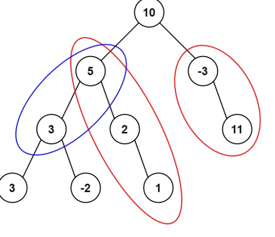

# Problem Statement

[LeetCode - Path Sum III](https://leetcode.com/problems/path-sum-iii/?envType=study-plan-v2&envId=leetcode-75)

Given the root of a binary **tree** and an integer **targetSum**, return the number of paths where the sum of the values along the path equals targetSum.

The path does not need to start or end at the root or a leaf, but it must go downwards (i.e., traveling only from parent nodes to child nodes).

## Examples

### Example 1



**Input**: root = [10,5,-3,3,2,null,11,3,-2,null,1], targetSum = 8
**Output**: 3
**Explanation**: The paths that sum to 8 are shown.

## Observations

Target sum calculation problems are typically using hashmaps with compliment logic. Our logic is that we will perform
$$ curr-target $$

This means that from our current sum we can remove the old sum we have along a branch to obtain a value. If this value is in the hashmap we can be assured that our sum is formed in that branch.

Considering example 1

```bash

VISITING node 10, curr_sum=10 with cache={0: 1}
VISITING node 5, curr_sum=15 with cache={0: 1, 10: 1}
VISITING node 3, curr_sum=18 with cache={0: 1, 10: 1, 15: 1}
VISITING node 3, curr_sum=21 with cache={0: 1, 10: 1, 15: 1, 18: 1}
VISITING node -2, curr_sum=16 with cache={0: 1, 10: 1, 15: 1, 18: 1, 21: 0}
VISITING node 2, curr_sum=17 with cache={0: 1, 10: 1, 15: 1, 18: 0, 21: 0, 16: 0}
VISITING node 1, curr_sum=18 with cache={0: 1, 10: 1, 15: 1, 18: 0, 21: 0, 16: 0, 17: 1}
VISITING node -3, curr_sum=7 with cache={0: 1, 10: 1, 15: 0, 18: 0, 21: 0, 16: 0, 17: 0}
VISITING node 11, curr_sum=18 with cache={0: 1, 10: 1, 15: 0, 18: 0, 21: 0, 16: 0, 17: 0, 7: 1}
OUTPUT: 3

```

The above dry run performs a DFS and does the following:

- Adds node.val in curr_sum
- Checks if curr_Sum - target in hashmap, if it is add the value to count otherwise add 0
- Add the curr_sum into the hashmap.
- Continue to perform DFS.
- Once a branch is explored, we will explore a new branch, thus we will decrement the curr_sum's hashmap value by 1

## Algorithm

1. Init cache = {0: 1}
2. Init self.count = 0
3. Perform DFS along with the above mentioned steps in observation.
4. Call DFS with root, curr_sum = 0
5. Return count

## Complexity

- **Time**: _O(N)_
- **Space**: _O(M) where m is the size of the map_

## Code

```python

# Definition for a binary tree node.
# class TreeNode:
#     def __init__(self, val=0, left=None, right=None):
#         self.val = val
#         self.left = left
#         self.right = right
class Solution:
    def pathSum(self, root: Optional[TreeNode], targetSum: int) -> int:
        cache = {0: 1}
        self.count = 0

        def dfs(node, curr_sum):
            if not node:
                return
            curr_sum += node.val
            print(f"VISITING node {node.val}, curr_sum={curr_sum}")
            self.count += cache.get(curr_sum - targetSum, 0)
            cache[curr_sum] = cache.get(curr_sum, 0) + 1

            dfs(node.left, curr_sum)
            dfs(node.right, curr_sum)

            cache[curr_sum] -= 1

        dfs(root, 0)
        return self.count

```

## Mistakes / Gotchas

1. Doing cache(curr_sum, 0) + 1 instead of cache.get(curr_sum, 0) + 1
2. Not decrementing the sum after a branch has been explored.
